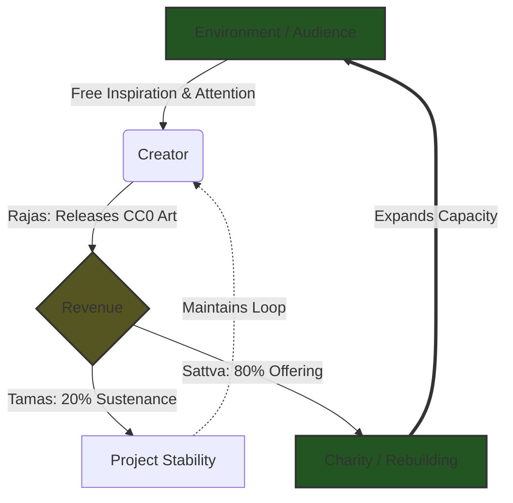

To manifest something from nothing—to bring the formless (*Nirgun*) into form (*Sagun*)—requires a structure. In Vedantic teachings, the universe relies on three fundamental qualities to carry out any process of creation and sustainment: **Sattva** (purity, balance, giving), **Rajas** (action, creation, passion), and **Tamas** (stability, grounding, preservation). 

The problem with the modern creative industry is that it has severed its connection to Sattva. 

Most businesses, musicians, and creators operate in a closed, two-part loop. They use Rajas to create an asset, and Tamas to hoard the financial return. It is a one-way street: knowledge out, money in. 

But this model ignores two critical realities of our universe: mathematical interdependence and the laws of thermodynamics. 

### The Downward Spiral: Fighting Entropy

The inspiration, knowledge, and tools used to create art are synthesized from the environment for free. When a creator takes free inputs, gatekeeps the output, and hoards the capital, they drain their own ecosystem. 

In physics, the universe fundamentally favors **entropy**—the natural spreading, sharing, and distribution of energy. When a creator hoards all the wealth and gatekeeps their knowledge, they are actively attempting to decrease local entropy. They are building a dam to trap energy. This artificial bottleneck requires immense force to maintain, causes stagnation, and ultimately collapses. 

Imagine an ecosystem consisting of 5 audience members and 1 creator. The creator takes their attention, offering only momentary dopamine in return, and extracts capital. Over time, that audience fatigues, finds better sources of dopamine, or simply cannot sustain the cost. The loop decays. The art eventually dies with the artist because the environment was left poorer than how it was found.

### The Core Philosophy: Free Input = Free Output 
#### ચોખ્ખો ને ચટ હિસાબ

Every piece of art is a byproduct of its environment. To build Hétu, I didn't invent music theory, nor did I write the software from scratch. My knowledge came from consuming free content available on the internet—YouTube tutorials, open-source forums, and shared ideas.

Because the input (the knowledge) was free, I believe the output (the music) must also be free. Gatekeeping this knowledge behind paywalls or strict copyright laws breaks the natural flow of information. That is why every track and Ableton project file released by Hétu is dedicated to the Public Domain (CC0).

### The Dilemma of "Inevitable Revenue"

If the music is free, why is there revenue at all?

While platforms like YouTube allow you to turn off monetization, closed ecosystems like Spotify and Apple Music do not. They charge users a subscription fee, and revenue is automatically generated whenever a song is played. You cannot opt out of earning money on these platforms.

Instead of rejecting these platforms—which is where most people listen to music—the Trinity Model intercepts this "inevitable revenue" and mathematically routes it to create an upward spiral of global growth.

### Visualizing the Ecosystems

**The Extractive Loop (Downward Spiral)**

```mermaid
graph TD
    A[Environment / Audience] -->|Free Inspiration & Attention| B(Creator)
    B -->|Gatekeeps Art| C{Revenue}
    C -->|Hoards Capital| D[Stagnation]
    D -.->|No Reinvestment| A
    style A fill:#444,stroke:#333,stroke-width:2px
    style D fill:#522,stroke:#333,stroke-width:2px
```

**The Trinity Loop (Upward Spiral)**

### Decoding the Trinity Loop
To counter the downward spiral, a process must incorporate Sattva. You must systematically give away what you received for free, ensuring the capital and information generated flow directly back into the environment, increasing the entropy and health of the system.

Here is exactly how the three energies interact in the Hétu ecosystem:

1. **Rajas (The Internet Loop)**
Rajas is the energy of action, passion, and creation. This is the engine of the project.

**What Hétu Gives (More Music):** I upload high-quality music and the raw, open-source project files to the internet for anyone to listen to, remix, or learn from. There is no gatekeeping. The information entropy is maximized.

**What Hétu Gets (More Revenue):** The attention the music gathers on streaming platforms like Spotify inevitably generates royalty payouts.

2. **Sattva (The Environment Loop)**
Sattva is the energy of purity, harmony, and giving. This is how we ensure the loop doesn't become a selfish, downward spiral.

**What Hétu Gives (More Charity):** 80% of the inevitable revenue is immediately and automatically routed away from me to high-impact humanitarian causes (like clean water, hunger relief, and disaster rebuilding).

**What Hétu Gets (More Growth):** By returning capital to Mother Earth, the environment heals. People gain access to basic human needs, allowing them to thrive, create, and discover art. The audience and the ecosystem grow organically because the foundation is built on goodwill, not extraction.

3. **Tamas (The Material Loop)**
Tamas is the energy of grounding, mass, and preservation. Without Tamas, a project will burn out and collapse under its own weight.

**What Hétu Gives (More Resources):** The remaining 20% of the revenue is allocated to the material costs of running the project.

**What Hétu Gets (More Stability):** This 20% pays for the DistroKid distribution fees, the Proton Drive server hosting (so the project files remain free to download), and the maintenance of musical instruments. It also pays for my food, rent, and basic survival. Tamas is the heavy, grounding force; you cannot sustain an ethereal project if the physical body starves. It ensures that I never have to abandon the project due to financial pressure. The loop becomes self-sustaining forever.

### The Math of the Infinite Loop
When Sattva is introduced, the equation flips from decay to compounding growth. The environment isn't just sustained; it is actively expanded.

Return to the scenario of 5 audience members and 1 creator. Through the Trinity Model, the attention of those 5 people generates capital. Because 80% of that capital is immediately diverted to build shelter, provide water, and fund education, the baseline health of the ecosystem improves.

The environment's capacity expands. By securing the basic needs of others, the ecosystem grows to 8 thriving members. The knowledge is not just traded for money; the knowledge uses money to create a healthier world, which in turn can support more art, more learning, and more listeners.

Your survival is no longer tied to extracting attention; it is tied to the survival and prosperity of the whole.

When you share the sauce, distribute the energy, and direct the revenue back to the earth, you align with the universe. You create an upward spiral. Even when the whole is taken from the whole, the whole remains.

 
ॐ पूर्णमदः पूर्णमिदं पूर्णात् पूर्णमुदच्यते 
पूर्णस्य पूर्णमादाय पूर्णमेवावशिष्यते॥ 
ॐ शान्तिः शान्तिः शान्तिः॥

